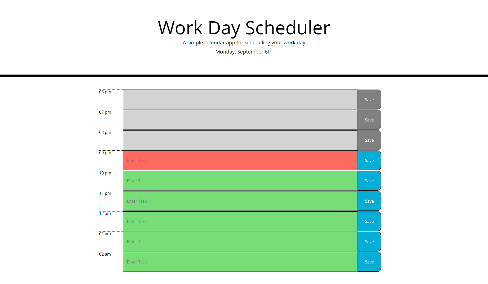

# Daily_Planner

## Description

This planner allows you to save a list of items in specific timeslots! These timeslots are updated hourly and when the next hour begins all items move up the list. Past items are uneditable and saves on those items are disabled. These items are saved in the localStorage and match the corrosponding hour with the key that is named for the hour that it was saved on. When these match the item is placed on the timeslot!

## URLs

GitHub repository: https://github.com/ajlineb/Daily_Planner

Webpage: https://ajlineb.github.io/Daily_Planner/

## Usage

To use the website, simply start adding items that you expect to finish within the hours on listed in the planner, click the save buttons for each item and keep yourself on track to finish your chores/tasks! If you want to delete an item from the list, delete what was written and click save, otherwise it will show up in 10 seconds when it updates itself.

## Images

## Credits

A portion of the website was developed by the Bootcamp team.

## License

No licenses